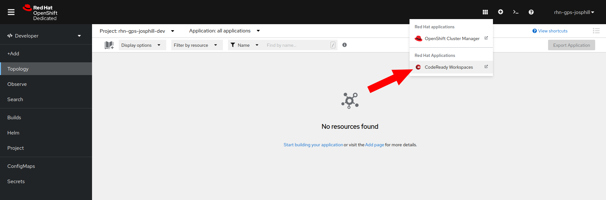
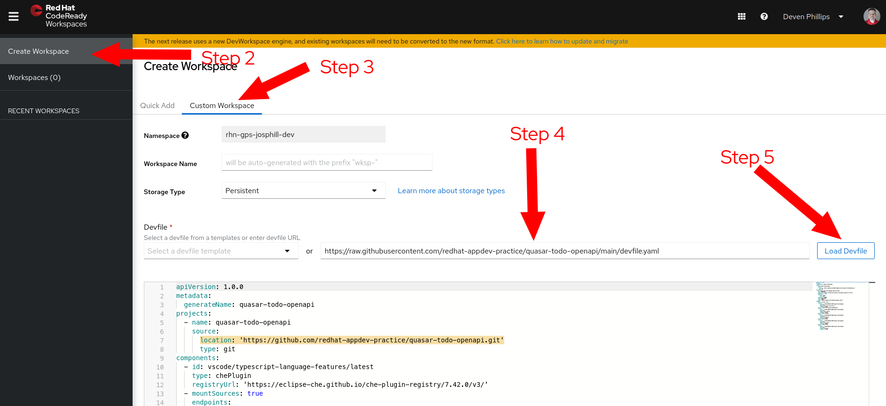
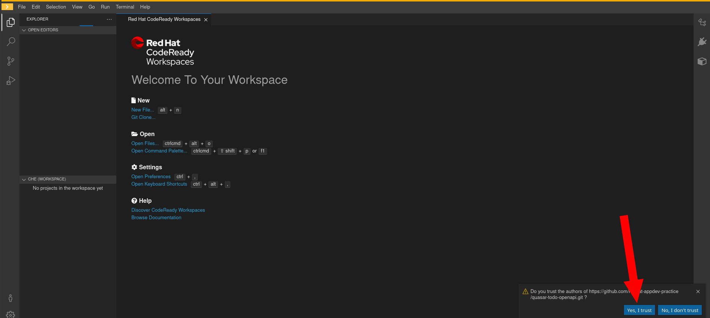
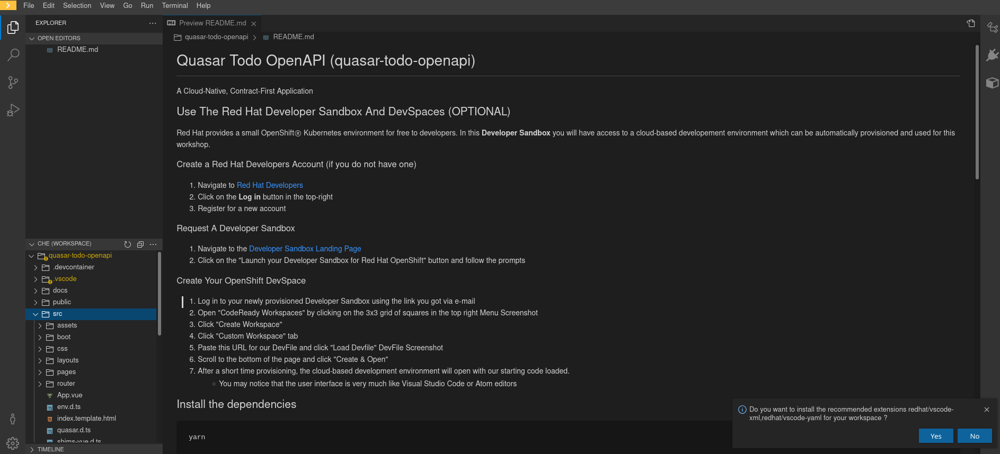

# Quasar Todo OpenAPI (quasar-todo-openapi)

A Cloud-Native, Contract-First Application Using Design Thinking

## Overview

During this workshop, we will be building a relatively simple Todo List application, but we will be doing it perhaps
differently than you might be used to. We're going to start from a validated user experience (e.g. A Figma Prototype),
implement a mock user interface using Contract-First API tooling (e.g. OpenAPI & Prism), and only **AFTER** we
are sure that our stakeholders are satisfied with our UX do we implement the API server.

The workshop is aimed at using
[Quasar Framework](https://quasar.dev) with [VueJS](https://vuejs.org), but the concepts work equally well with any
UI toolkit or framework. You are welcome to try with Svelte, React, or Angular as well if they are more familiar to you.

You are welcome to use whichever IDE or editor you are comfortable with during the workshop. I have included "hints" in
this repository to install helpful plugins for [VSCode](https://code.visualstudio.com/) and you may also see the
presenter use [WebStorm](https://www.jetbrains.com/webstorm/) or [OpenShift DevSpaces](https://developers.redhat.com/products/codeready-workspaces/overview)

## Our Validated Design

You can view our "prototype" in Figma [HERE](https://www.figma.com/proto/FKGtcMU6lfafc3oKzAJNQM/Todo?node-id=5%3A1091&scaling=min-zoom&page-id=0%3A1&starting-point-node-id=5%3A1091)
or as a PDF [HERE](docs/Todo_Design.pdf)

## Use The Red Hat Developer Sandbox And DevSpaces (OPTIONAL)

Red Hat provides a small OpenShiftⓇ Kubernetes environment for free to developers. In this **Developer Sandbox** you
will have access to a cloud-based developement environment which can be automatically provisioned and used for this
workshop.

### Create a Red Hat Developers Account (if you do not have one)
1. Navigate to [Red Hat Developers](https://developers.redhat.com/)
2. Click on the **Log in** button in the top-right
3. Register for a new account

### Request A Developer Sandbox

1. Navigate to the [Developer Sandbox Landing Page](https://developers.redhat.com/developer-sandbox/get-started)
2. Click on the "Launch your Developer Sandbox for Red Hat OpenShift" button and follow the prompts

### Create Your OpenShift DevSpace

1. Log in to your newly provisioned Developer Sandbox using the link you got via e-mail
2. Open "CodeReady Workspaces" by clicking on the 3x3 grid of squares in the top right 
3. Click "Create Workspace"
4. Click "Custom Workspace" tab
5. Paste this URL for our DevFile and click "Load Devfile" 
   * `https://raw.githubusercontent.com/redhat-appdev-practice/quasar-todo-openapi/main/devfile.yaml`
6. Scroll to the bottom of the page and click "Create & Open"
7. After a short time provisioning, the cloud-based development environment will open with our starting code loaded.
   * You may notice that the user interface is very much like Visual Studio Code or Atom editors
8. Click "Yes, I trust" when prompted if you trust the authors of the code being loaded 
9. You should now see the project loaded in your DevSpace 

## Install the dependencies
```bash
yarn
```

### Start the app in development mode (hot-code reloading, error reporting, etc.)
```bash
yarn watch
```

### Build the app for production
```bash
yarn build
```

## Configure NPM Proxy Cache

Because everyone at the conference is using the same public IP, there is a chance that we will
hit the NPM rate-limit. If this happens, I have brought a computer which is running Sonatype Nexus
to act as an NPM Proxy/Cache

From your command-line, run the following commands:

```bash
npm config set registry http://192.168.1.97:8081/repository/npmjs/
npm config set always-auth true
npm login --registry=http://192.168.1.97:8081/repository/npmjs/
# Username: admin
# Password: npmpassword
# Email: (this IS public) anything@anydomain.com
yarn config set registry http://192.168.1.97:8081/repository/npmjs/
```

### Customize the configuration
See [Configuring quasar.config.js](https://v2.quasar.dev/quasar-cli-webpack/quasar-config-js).
